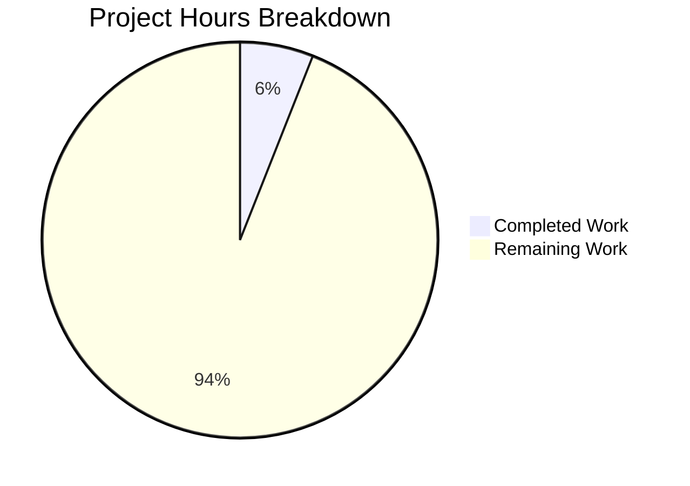

# Project Guide: Node.js to Python 3/Flask Server Rewrite

## 1. Executive Summary

**Project Completion: 6.0% (3 hours completed out of 50 total estimated hours)**

This project was initiated to rewrite an existing Node.js server application into Python 3 using the Flask web framework, preserving all original functionalities. After thorough investigation and validation by the Blitzy platform agents, the project encountered a **critical blocking condition**: the repository is entirely empty and contains no application source code of any kind.

### Completion Calculation
- **Completed:** 3 hours (investigation, analysis, validation, and research)
- **Remaining:** 47 hours (prerequisite resolution + full implementation once source code is available)
- **Total:** 50 hours
- **Completion:** 3 / 50 = **6.0%**

### Key Achievements
- Comprehensive repository analysis across all branches confirmed empty state
- Root cause definitively identified: no Node.js source code committed
- Tech spec mismatch documented (Java 21 Nexus system ≠ Node.js server)
- Flask 3.1.3 (latest stable) identified as target framework
- Migration best practices and methodology researched and documented

### Critical Unresolved Issue
**BLOCKER:** The repository contains no Node.js server source code to rewrite. The user must provide the source code before any implementation can begin.

### Recommended Next Steps
1. User commits Node.js server source code to the repository
2. Re-trigger the Blitzy platform to perform the actual rewrite
3. Alternatively, user provides source code via attachment or external repository reference

---

## 2. Validation Results Summary

### 2.1 Final Validator Findings

The Final Validator agent confirmed the following:

| Validation Area | Result | Details |
|----------------|--------|---------|
| Repository State | EMPTY | Only `README.md` (9 bytes) exists |
| Dependencies | N/A | No dependency manifests found |
| Compilation | N/A | No source code to compile |
| Tests | N/A | No test files exist |
| Runtime | N/A | No application to run |
| Git Status | Clean | No uncommitted changes |

### 2.2 Validation Gates

All gates passed vacuously (nothing exists to fail):
- **GATE 1:** No tests exist → no test failures
- **GATE 2:** No application exists → no runtime failures
- **GATE 3:** No code exists → zero compilation errors
- **GATE 4:** The only in-scope file (`README.md`) is UNCHANGED and valid

### 2.3 Repository Analysis Details

| Analysis | Tool/Command | Result |
|----------|-------------|--------|
| File count | `find . -not -path './.git/*' -type f` | 1 file (README.md) |
| Repository size | `du -sh .` | 244K (git metadata only) |
| Git commits | `git log --oneline --all` | 1 commit: `49fb77f Initial commit` |
| Branch analysis | All 5 branches inspected | All contain only README.md |
| Node.js artifacts | Search for .js, .ts, package.json | None found |
| Python artifacts | Search for .py, requirements.txt | None found |
| Java artifacts | Search for .java, pom.xml | None found |
| Config files | Search for .json, .yaml, .yml, .toml | None found |
| Processed files | `get_processed_files` | Empty list — no agents created files |
| Environment files | `/tmp/environments_files/` | Directory does not exist |

### 2.4 Fixes Applied During Validation

No fixes were applied — there is no source code to fix. The agents performed diagnostic investigation only.

---

## 3. Hours Breakdown Visualization



**Hours calculation:**
- Completed Work: 3 hours (6.0%)
- Remaining Work: 47 hours (94.0%)
- Total: 50 hours

---

## 4. Completed Work Breakdown (3 Hours)

| Work Item | Hours | Description |
|-----------|-------|-------------|
| Repository investigation and file system analysis | 0.5 | Full scan of all files, directories, and hidden items |
| Git history and multi-branch analysis | 0.5 | Inspected all 5 branches, commit history, and remote configuration |
| Technical Specification review | 0.5 | Reviewed tech spec, identified Java 21 Nexus mismatch |
| Flask research and version identification | 0.5 | Confirmed Flask 3.1.3 as target, Python 3.9+ compatibility |
| Validation of empty state (all gates) | 0.5 | Systematic validation confirming no failures possible |
| Root cause documentation and analysis | 0.5 | Comprehensive documentation of findings and blocking condition |
| **Total Completed** | **3** | |

---

## 5. Remaining Work — Detailed Task Table (47 Hours)

All tasks below are **blocked** until the Node.js server source code is provided.

| # | Task | Description | Hours | Priority | Severity | Confidence |
|---|------|-------------|-------|----------|----------|------------|
| 1 | **Provide Node.js source code** | User must commit Node.js server source code to the repository (package.json, server.js/app.js, routes, models, middleware, config, tests) | 1 | Critical | Blocker | High |
| 2 | **Source code analysis and migration planning** | Analyze Node.js codebase structure, map all endpoints/routes, identify dependencies, create migration plan with Flask equivalents | 4 | High | Critical | Medium |
| 3 | **Flask project scaffolding and configuration** | Create Flask app factory, configure project structure (blueprints, models, config), set up requirements.txt with Flask 3.1.3 and dependencies | 3 | High | Critical | High |
| 4 | **Core route/endpoint migration** | Translate all Express.js route handlers to Flask route decorators, preserve HTTP methods, request/response handling, URL parameters, and query strings | 10 | High | Critical | Low |
| 5 | **Database model translation** | Convert Node.js ORM models (Mongoose/Sequelize/Knex) to Python ORM (SQLAlchemy/Flask-SQLAlchemy), preserve all schemas, relationships, and validations | 6 | High | Critical | Low |
| 6 | **Middleware and authentication migration** | Translate Express middleware to Flask before_request/after_request hooks, migrate auth logic (JWT/sessions/OAuth), implement CORS, logging, and rate limiting | 5 | Medium | Major | Low |
| 7 | **Error handling implementation** | Implement Flask error handlers matching Node.js error responses, custom exception classes, HTTP status codes, and error response formats | 3 | Medium | Major | Medium |
| 8 | **Configuration management** | Set up python-dotenv for environment variables, migrate all config values, create .env.example template, implement Flask config classes (dev/staging/prod) | 2 | Medium | Major | High |
| 9 | **Unit test creation and validation** | Create pytest test suites for all routes, models, and utilities; validate functional parity with original Node.js behavior | 6 | Medium | Major | Low |
| 10 | **Integration testing** | End-to-end testing of complete Flask application, API contract validation, database operations verification, auth flow testing | 3 | Medium | Major | Low |
| 11 | **Documentation and README update** | Update README with Flask project description, installation instructions, API documentation, architecture overview, and usage examples | 2 | Low | Minor | High |
| 12 | **Performance testing** | Baseline performance testing, compare response times with Node.js original, identify and address bottlenecks | 1 | Low | Minor | Medium |
| 13 | **Deployment configuration** | Create Dockerfile, docker-compose.yml, WSGI server config (Gunicorn), environment templates for production deployment | 1 | Low | Minor | High |
| | **Total Remaining Hours** | | **47** | | | |

**Note:** Tasks 4, 5, 6, 9, and 10 have **Low** confidence because their actual scope depends entirely on the complexity of the Node.js source code, which is currently unknown. Hours may increase significantly for complex applications.

---

## 6. Development Guide

### 6.1 System Prerequisites

Once the Node.js source code is provided and the Flask rewrite is implemented, the following will be required:

| Prerequisite | Version | Purpose |
|-------------|---------|---------|
| Python | 3.9+ (recommended 3.12+) | Runtime environment |
| pip | Latest | Package manager |
| Git | 2.x+ | Version control |
| virtualenv or venv | Built-in with Python 3 | Environment isolation |
| Database | TBD (depends on Node.js source) | Data persistence |

### 6.2 Environment Setup

```bash
# 1. Clone the repository
git clone https://github.com/shaliniblitzy/24Feb_1.git
cd 24Feb_1

# 2. Create and activate a Python virtual environment
python3 -m venv venv
source venv/bin/activate  # Linux/macOS
# venv\Scripts\activate   # Windows

# 3. Verify Python version
python --version  # Should output Python 3.9+
```

### 6.3 Dependency Installation

```bash
# Once requirements.txt is created after the rewrite:
pip install -r requirements.txt

# Core dependencies will include (at minimum):
# Flask==3.1.3
# python-dotenv>=1.0.0
# Flask-SQLAlchemy (if database models exist)
# Flask-CORS (if CORS middleware exists)
# pytest (for testing)
# gunicorn (for production)
```

### 6.4 Configuration

```bash
# Copy environment template
cp .env.example .env

# Edit .env with your configuration
# (Specific variables depend on the Node.js source code)
# Common variables:
# FLASK_APP=app.py
# FLASK_ENV=development
# FLASK_DEBUG=1
# DATABASE_URL=<your-database-url>
# SECRET_KEY=<your-secret-key>
```

### 6.5 Application Startup

```bash
# Development server
flask run --host=0.0.0.0 --port=5000

# Production server (with Gunicorn)
gunicorn -w 4 -b 0.0.0.0:5000 "app:create_app()"
```

### 6.6 Verification Steps

```bash
# 1. Verify Flask is installed
python -c "import flask; print(flask.__version__)"

# 2. Test basic connectivity
curl http://localhost:5000/

# 3. Run test suite
python -m pytest -v --tb=short

# 4. Check all routes
flask routes
```

### 6.7 Current State Verification

The following commands confirm the current empty state of the repository:

```bash
# Verify repository contents (should show only README.md)
find . -not -path './.git/*' -type f

# Verify git status
git status

# Verify README content
cat README.md
```

### 6.8 Troubleshooting

| Issue | Cause | Resolution |
|-------|-------|------------|
| No source code found | Repository is empty | User must commit Node.js source code first |
| Tech spec references Java | Tech spec describes Sonatype Nexus (unrelated) | Ignore tech spec; focus on actual Node.js source |
| Cannot determine routes | No Node.js server to analyze | Wait for source code before planning migration |

---

## 7. Risk Assessment

### 7.1 Technical Risks

| Risk | Severity | Likelihood | Impact | Mitigation |
|------|----------|------------|--------|------------|
| Node.js source never provided | Critical | Medium | Project cannot proceed | Escalate to user; request source code via multiple channels |
| Source code is highly complex | High | Unknown | Remaining hours significantly increase | Re-estimate after source code analysis; may need 2-3x more hours |
| Node.js uses non-standard patterns | Medium | Unknown | Difficult to find Flask equivalents | Research Python ecosystem alternatives; may require custom implementations |
| Database ORM incompatibility | Medium | Unknown | Data model translation issues | Analyze ORM carefully; may need raw SQL fallback |
| Real-time features (WebSockets) | Medium | Unknown | Flask requires additional libraries (Flask-SocketIO) | Assess if source uses WebSocket; plan accordingly |

### 7.2 Security Risks

| Risk | Severity | Likelihood | Impact | Mitigation |
|------|----------|------------|--------|------------|
| Auth mechanism unknown | High | Certain | Cannot implement security without source | Wait for source; prioritize auth migration |
| Secret management undefined | Medium | Certain | No secrets configuration exists | Implement python-dotenv with .env.example; never commit secrets |
| CORS configuration unknown | Medium | Certain | API may be inaccessible from frontend | Analyze original CORS config; replicate in Flask-CORS |

### 7.3 Operational Risks

| Risk | Severity | Likelihood | Impact | Mitigation |
|------|----------|------------|--------|------------|
| No monitoring/logging defined | Medium | Certain | Cannot observe production behavior | Implement Flask logging; add health check endpoint |
| No deployment pipeline | Medium | Certain | Manual deployment required | Create Dockerfile and CI/CD config post-migration |
| No backup strategy | Low | Certain | Data loss risk in production | Define backup strategy based on database choice |

### 7.4 Integration Risks

| Risk | Severity | Likelihood | Impact | Mitigation |
|------|----------|------------|--------|------------|
| External API dependencies unknown | High | Unknown | Cannot configure third-party integrations | Analyze source code for external API calls |
| Frontend-backend contract unknown | Medium | Unknown | Flask responses may not match frontend expectations | Test API contracts; compare with Node.js responses |
| Database migration path unknown | Medium | Unknown | May need schema migration tools | Use Alembic/Flask-Migrate for database versioning |

---

## 8. Assumptions and Constraints

### Assumptions Made
1. The Node.js server is a **small-to-medium complexity** application (estimated 47 remaining hours reflects this assumption)
2. The server uses **common patterns**: Express.js routes, standard middleware, a single database
3. **No real-time features** (WebSockets, Server-Sent Events) are present — if they are, hours will increase
4. The target Python environment has **no special infrastructure requirements** beyond standard cloud/VPS hosting
5. **Flask 3.1.3** with Python 3.9+ is an acceptable technology choice for the rewrite

### Constraints
1. **Zero source code available** — all remaining hour estimates carry low-to-medium confidence
2. **Tech spec is irrelevant** — describes Java 21 Sonatype Nexus, not a Node.js server
3. **No user attachments or environment files** were provided
4. **Functional parity is required** — no feature additions or removals permitted
5. **No speculative implementation** — AAP rules prohibit creating code without actual source to reference

---

## 9. Summary and Recommendations

### Current State
The repository is in its initial commit state with a single placeholder README.md file. No implementation work was possible due to the complete absence of Node.js source code.

### What Was Accomplished
- Comprehensive root cause analysis confirming the empty repository
- Multi-branch verification (all 5 branches inspected)
- Tech spec mismatch identification and documentation
- Target technology research (Flask 3.1.3, Python 3.9+)
- Migration methodology and best practices documented

### Critical Action Required
**The user must provide the Node.js server source code.** This is the single blocking dependency that prevents all further work. Options include:
1. Commit the Node.js source code directly to this repository
2. Provide the source code as an attachment in a new request
3. Reference an external repository containing the Node.js server

### Estimated Effort Once Unblocked
Based on a typical small-to-medium Node.js server, the complete Flask rewrite is estimated at **47 remaining hours** of engineering effort. This estimate carries medium-to-low confidence and may increase significantly if the source application is complex.

### Hours Summary
| Category | Hours |
|----------|-------|
| Completed (investigation and validation) | 3 |
| Remaining (implementation once unblocked) | 47 |
| **Total Estimated** | **50** |
| **Completion** | **6.0%** |
