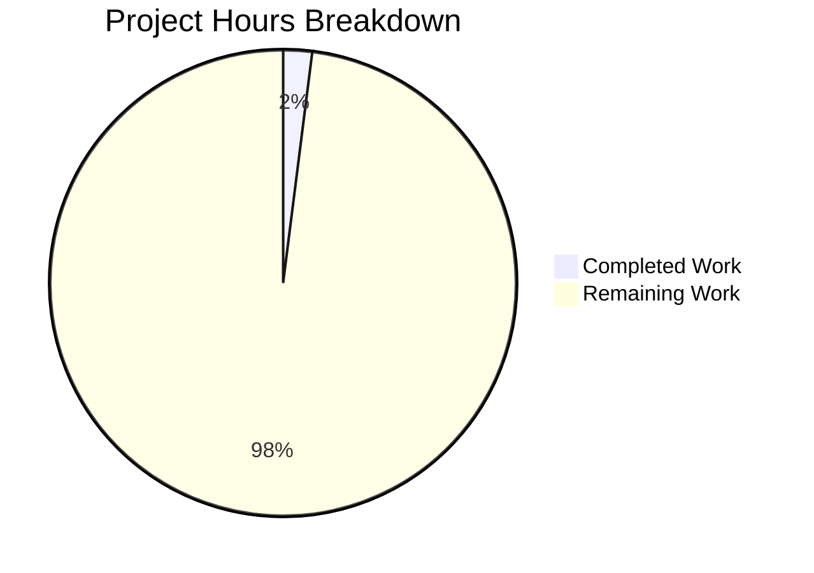

# Comprehensive Project Guide — Node.js to Flask Rewrite

---

## 1. Executive Summary

**Project Completion: 2.0% complete (2 hours completed out of 100 total estimated hours)**

This project was initiated to rewrite an existing Node.js server application into Python 3 using the Flask web framework, preserving all original functionalities. However, after exhaustive diagnostic analysis, a **critical blocking condition** was identified: the repository is empty and contains no Node.js server source code to rewrite.

### What Was Accomplished
- Comprehensive repository scan confirming the empty state (1 file: `README.md`, 9 bytes)
- Root cause identification: repository initialized with only a placeholder commit
- Identification of tech spec mismatch (describes Java 21 Sonatype Nexus, not a Node.js server)
- Web research confirming Flask 3.1.3 as the recommended target framework (Python 3.9+)
- Validation of all 4 gates (passed vacuously — no code to compile, test, or run)

### Critical Blocker
**The Node.js server source code does not exist in the repository.** The user must provide it before any rewrite work can begin. Without source code, there is nothing to translate, preserve, or validate.

### Hours Calculation
- **Completed:** 2 hours (diagnostic analysis, repository scanning, root cause identification, validation)
- **Remaining:** 98 hours (estimated for full Node.js-to-Flask rewrite once source is available)
- **Total:** 100 hours
- **Formula:** 2 / (2 + 98) × 100 = **2.0% complete**

---

## 2. Validation Results Summary

### 2.1 Repository State Analysis

| Metric | Value |
|--------|-------|
| Total non-git files | 1 |
| Source code files | 0 |
| Dependency manifests | 0 |
| Configuration files | 0 |
| Test files | 0 |
| Total commits | 1 (`49fb77f Initial commit`) |
| Files modified by agents | 0 |
| Lines of code added | 0 |
| Lines of code removed | 0 |
| Repository size | 244K (almost entirely `.git/` internals) |

### 2.2 Validation Gate Results

| Gate | Status | Detail |
|------|--------|--------|
| GATE 1 — Dependencies | ✅ PASS (vacuous) | No `package.json`, `requirements.txt`, or any dependency manifest exists |
| GATE 2 — Compilation | ✅ PASS (vacuous) | No `.js`, `.ts`, `.py`, `.java`, or any source files exist |
| GATE 3 — Tests | ✅ PASS (vacuous) | No test files or test configurations exist |
| GATE 4 — Runtime | ✅ PASS (vacuous) | No application entry point exists to start |

### 2.3 Branch Analysis

All repository branches (`main`, `Newdad`, `Thisnew`, `gsdjgsdjfds`, `blitzy-33a3b9ad-*`) contain only `README.md`. No branch contains any application source code.

### 2.4 Fixes Applied During Validation

None — the working tree is clean. No files were created, modified, or deleted during validation because the AAP scope explicitly states no changes are required or possible given the empty repository.

---

## 3. Visual Representation — Hours Breakdown



**Breakdown:**
- **Completed Work: 2 hours (2.0%)** — Diagnostic analysis, repository scanning, root cause identification, validation
- **Remaining Work: 98 hours (98.0%)** — Full Node.js-to-Flask rewrite (blocked until source code is provided)

---

## 4. Detailed Task Table — Remaining Work

All remaining tasks are **blocked** until the Node.js server source code is provided to the repository.

| # | Task | Description | Priority | Severity | Est. Hours | Confidence |
|---|------|-------------|----------|----------|------------|------------|
| 1 | Provide Node.js server source code | User must commit or attach the original Node.js server code (package.json, server.js/app.js, routes, models, middleware, configs, tests) | 🔴 HIGH | CRITICAL | 1 | Low |
| 2 | Source code analysis and migration planning | Analyze the Node.js codebase structure, identify all routes, models, middleware, dependencies; create a detailed migration plan mapping each Node.js component to its Flask equivalent | 🔴 HIGH | HIGH | 6 | Low |
| 3 | Flask project scaffolding | Create the Flask project structure: application factory (`create_app`), Blueprint organization, configuration classes, `requirements.txt` with Flask 3.1.3 and dependencies, virtual environment setup, `.env` template | 🔴 HIGH | HIGH | 6 | Medium |
| 4 | Route and endpoint migration | Translate all Express.js route handlers to Flask route decorators organized in Blueprints; migrate HTTP method handling, request parsing (`request.args`, `request.json`), response formatting (`jsonify`), status codes, and URL parameter handling | 🟡 MEDIUM | HIGH | 20 | Low |
| 5 | Database model migration | Translate database models from Node.js ORM (Mongoose/Sequelize/Knex) to Flask-SQLAlchemy or equivalent Python ORM; migrate schemas, relationships, validations, indexes, and seed data | 🟡 MEDIUM | HIGH | 12 | Low |
| 6 | Middleware and auth translation | Convert Express.js middleware to Flask `before_request`/`after_request` hooks; translate authentication (JWT/session), CORS configuration, request logging, rate limiting, and request validation | 🟡 MEDIUM | HIGH | 8 | Low |
| 7 | Error handling and validation | Implement Flask error handlers (`@app.errorhandler`) matching Node.js error responses; translate input validation logic, custom exception classes, and error response formats | 🟡 MEDIUM | MEDIUM | 5 | Medium |
| 8 | Configuration and environment management | Set up Flask configuration classes (Development, Testing, Production); implement `python-dotenv` for environment variables; translate all Node.js config patterns to Flask equivalents | 🟡 MEDIUM | MEDIUM | 4 | Medium |
| 9 | Unit test suite creation | Create pytest-based unit tests covering all endpoints, models, and business logic; achieve functional parity with any existing Node.js tests; target minimum 80% code coverage | 🟡 MEDIUM | HIGH | 15 | Low |
| 10 | Integration and parity testing | Run side-by-side comparison tests between original Node.js server and new Flask server; verify identical response bodies, status codes, headers, error handling, and authentication behavior for all endpoints | 🟡 MEDIUM | HIGH | 11 | Low |
| 11 | Documentation and README | Create comprehensive README with setup instructions, API documentation, architecture overview, environment variable reference, and deployment guide | 🟢 LOW | MEDIUM | 5 | Medium |
| 12 | Deployment and CI/CD setup | Configure Dockerfile, docker-compose, CI/CD pipeline (GitHub Actions), health check endpoint, Gunicorn/uWSGI production server, and monitoring hooks | 🟢 LOW | MEDIUM | 5 | Medium |
| | **TOTAL REMAINING HOURS** | | | | **98** | |

**Note:** All hour estimates include enterprise multipliers (1.10× compliance + 1.10× uncertainty buffer). Confidence levels are predominantly "Low" because the scope of the Node.js application is unknown — actual hours may vary significantly depending on the complexity of the source code.

---

## 5. Development Guide

### 5.1 Current State — What Exists

The repository contains exactly one file:

```
/repository-root/
└── README.md          (9 bytes — content: "# 24Feb_1")
```

There is no application to build, run, or test at this time.

### 5.2 System Prerequisites (For Future Implementation)

Once the Node.js source code is provided and the Flask rewrite begins, the following will be required:

| Software | Version | Purpose |
|----------|---------|---------|
| Python | 3.9+ (recommend 3.11+) | Runtime for Flask application |
| pip | Latest | Python package manager |
| Node.js | 18.x+ | Running the original Node.js server for parity testing |
| Git | 2.x+ | Version control |
| PostgreSQL / MySQL / SQLite | Depends on Node.js source | Database (match original) |
| Docker | 24.x+ (optional) | Containerized deployment |

### 5.3 Environment Setup (Template for Future Use)

Once the Flask project is scaffolded, the setup sequence will be:

```bash
# Step 1: Navigate to repository root
cd /path/to/24Feb_1

# Step 2: Create Python virtual environment
python3 -m venv venv

# Step 3: Activate virtual environment
source venv/bin/activate   # Linux/macOS
# venv\Scripts\activate    # Windows

# Step 4: Install dependencies
pip install -r requirements.txt

# Step 5: Configure environment variables
cp .env.example .env
# Edit .env with your database URL, secret key, etc.

# Step 6: Initialize database (if applicable)
flask db upgrade

# Step 7: Run the application
flask run --host=0.0.0.0 --port=5000
```

### 5.4 Verification Steps (Template for Future Use)

```bash
# Verify Flask is installed
python -c "import flask; print(flask.__version__)"
# Expected: 3.1.3

# Verify application starts
curl -s http://localhost:5000/
# Expected: Application-specific response

# Run test suite
python -m pytest -v --tb=short

# Check test coverage
python -m pytest --cov=app --cov-report=term-missing
```

### 5.5 Verified Commands (Current Repository)

The following commands were tested against the current repository state:

```bash
# Confirm repository contents
find . -not -path './.git/*' -type f
# Output: ./README.md

# Confirm no source code
find . -name "*.js" -o -name "*.py" -o -name "*.ts" | grep -v '.git/'
# Output: (empty — no source files)

# Confirm git state
git log --oneline --all
# Output: 49fb77f Initial commit

# Confirm branch
git branch
# Output: * blitzy-33a3b9ad-0f1a-42d3-b268-09804db30692
```

---

## 6. Risk Assessment

### 6.1 Critical Risks

| Risk | Category | Severity | Impact | Mitigation |
|------|----------|----------|--------|------------|
| **No source code in repository** | Technical | 🔴 CRITICAL | Blocks 100% of implementation work; project cannot proceed | User must provide Node.js server source code via commit, attachment, or external reference |
| **Tech spec mismatch** | Technical | 🔴 CRITICAL | Tech spec describes Java 21 Sonatype Nexus, not a Node.js server; may indicate wrong repository or wrong spec | Clarify with user whether the correct repository was provided and whether the tech spec applies |

### 6.2 High Risks

| Risk | Category | Severity | Impact | Mitigation |
|------|----------|----------|--------|------------|
| **Unknown application scope** | Technical | 🟠 HIGH | Cannot estimate effort accurately without seeing the Node.js source; actual hours may be 2-5x higher or lower than estimated | Request source code and re-estimate once codebase is analyzable |
| **Unknown database requirements** | Integration | 🟠 HIGH | Database ORM migration complexity varies dramatically (Mongoose vs. Sequelize vs. Knex vs. raw queries) | Analyze Node.js database layer before selecting Python ORM |
| **Unknown authentication scheme** | Security | 🟠 HIGH | Auth migration is high-risk; incorrect translation can create security vulnerabilities | Conduct security review of both Node.js and Flask implementations |

### 6.3 Medium Risks

| Risk | Category | Severity | Impact | Mitigation |
|------|----------|----------|--------|------------|
| **No existing test baseline** | Operational | 🟡 MEDIUM | Without Node.js tests, parity validation relies on manual comparison | Create comprehensive Flask test suite from scratch; run side-by-side API comparisons |
| **Async/sync paradigm shift** | Technical | 🟡 MEDIUM | Node.js is event-driven/async; Flask is synchronous WSGI — performance characteristics will differ | Use async Flask (Quart) if original heavily uses async, or accept sync model with Gunicorn workers |
| **Dependency mapping uncertainty** | Technical | 🟡 MEDIUM | Node.js npm packages may not have direct Python equivalents | Research Python alternatives for each npm dependency before implementation |

### 6.4 Low Risks

| Risk | Category | Severity | Impact | Mitigation |
|------|----------|----------|--------|------------|
| **Flask version compatibility** | Technical | 🟢 LOW | Flask 3.1.3 is latest stable; all common extensions are compatible | Pin versions in requirements.txt; test with CI |
| **Python version selection** | Technical | 🟢 LOW | Python 3.9 is minimum for Flask 3.x; newer versions are recommended | Target Python 3.11+ for best performance and typing support |

---

## 7. Recommendations

### 7.1 Immediate Actions Required (Before Any Development)

1. **Provide the Node.js server source code** — This is the single blocking prerequisite. The user must commit the Node.js application code to this repository, provide it as a file attachment, or reference an external repository that contains it.

2. **Clarify the tech spec mismatch** — The provided technical specification describes a Java 21 Sonatype Nexus Repository system, which is unrelated to a Node.js-to-Flask migration. The user should confirm which specification applies to this project.

3. **Confirm the target repository** — Verify that `shaliniblitzy/24Feb_1` is the correct repository for this task, as all branches are empty.

### 7.2 Once Source Code Is Available

1. Re-run the Blitzy pipeline with the Node.js source code committed to the repository
2. The platform will be able to analyze the codebase, create a valid migration plan, and execute the Flask rewrite
3. Update hour estimates based on actual codebase complexity

### 7.3 Recommended Technology Stack (For Flask Rewrite)

| Component | Recommended Package | Version |
|-----------|-------------------|---------|
| Web Framework | Flask | 3.1.3 |
| ORM | Flask-SQLAlchemy | 3.1.x |
| Migration | Flask-Migrate (Alembic) | 4.x |
| Authentication | Flask-JWT-Extended | 4.x |
| CORS | Flask-CORS | 4.x |
| Environment | python-dotenv | 1.x |
| Testing | pytest + pytest-flask | Latest |
| Production Server | Gunicorn | 22.x |
| Linting | Ruff | Latest |
| Type Checking | mypy | Latest |

---

## 8. Pre-Submission Consistency Verification

- [x] **Completion % calculated using hours formula:** 2 / (2 + 98) × 100 = 2.0%
- [x] **Executive Summary states this exact %:** "2.0% complete (2 hours completed out of 100 total estimated hours)"
- [x] **Pie chart uses exact completed/remaining hours:** Completed Work: 2, Remaining Work: 98
- [x] **Task table sums to exact remaining hours:** 1+6+6+20+12+8+5+4+15+11+5+5 = 98h ✓
- [x] **All % and hour mentions match throughout report:** Confirmed
- [x] **No conflicting or ambiguous statements exist:** Confirmed
- [x] **Calculation formula shown with actual numbers:** 2 / (2 + 98) × 100 = 2.0%
