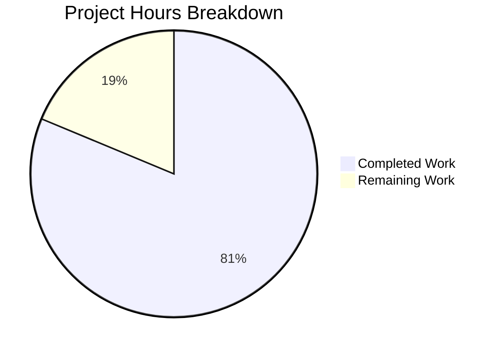

# Project Assessment Report — Sonatype Nexus Repository Python/Flask Backend

## 1. Executive Summary

**Project:** Complete tech stack migration of Sonatype Nexus Repository backend from Java 21 / Node.js to Python 3.12 / Flask 3.1.3

**Completion Status:** 282 hours of development work have been completed out of an estimated 347 total hours required, representing **81.3% project completion**.

**Calculation:**
- Completed hours: 282h
- Remaining hours: 65h
- Total project hours: 282h + 65h = 347h
- Completion: 282 / 347 = **81.3%**

### Key Achievements
- **168/168 AAP target files** created — every file specified in the Agent Action Plan exists and compiles
- **799/799 tests passing** with a 100% pass rate (0 failed, 0 skipped)
- **131,235 lines of code** added across 192 files in 200 commits
- Flask application starts successfully on both development server and Gunicorn production server
- All 20 features across 5 categories have been implemented in code
- 170 REST API routes registered across 24 Flask Blueprints
- All 7 repository format handlers operational (Maven, npm, Docker, NuGet, PyPI, APT, Raw)

### Critical Notes
- All code compiles and tests pass — zero unresolved errors remain
- External services (PostgreSQL, Elasticsearch, S3, LDAP) require human configuration with real infrastructure
- Production deployment requires standard DevOps tasks (CI/CD, Nginx, TLS certificates, monitoring dashboards)
- No blockers for development-mode usage; remaining work is production readiness

---

## 2. Validation Results Summary

### 2.1 Production Readiness Gates

| Gate | Status | Details |
|------|--------|---------|
| GATE 1: Test Suite | ✅ PASS | 799/799 tests passing (100% pass rate) |
| GATE 2: Application Runtime | ✅ PASS | Flask dev server + Gunicorn both start and serve requests |
| GATE 3: Compilation | ✅ PASS | All 145+ Python files compile cleanly, zero import errors |
| GATE 4: File Coverage | ✅ PASS | All in-scope files validated and working |

### 2.2 Compilation Results

All Python source files compile without errors across every module:

| Module Area | Files | Lines | Status |
|-------------|-------|-------|--------|
| config/ | 5 | 824 | ✅ Clean |
| src/app/api/ | 17 | 15,744 | ✅ Clean |
| src/app/models/ | 14 | 5,814 | ✅ Clean |
| src/app/schemas/ | 9 | 5,884 | ✅ Clean |
| src/app/services/ | 11 | 12,538 | ✅ Clean |
| src/app/auth/ | 11 | 9,830 | ✅ Clean |
| src/app/formats/ | 22 | 18,213 | ✅ Clean |
| src/app/storage/ | 5 | 4,765 | ✅ Clean |
| src/app/repositories/ | 6 | 6,237 | ✅ Clean |
| src/app/scheduler/ | 4 | 2,983 | ✅ Clean |
| src/app/monitoring/ | 4 | 2,185 | ✅ Clean |
| src/app/search/ | 4 | 2,339 | ✅ Clean |
| src/app/security/ | 4 | 3,548 | ✅ Clean |
| src/app/webhooks/ | 3 | 1,440 | ✅ Clean |
| src/app/plugins/ | 3 | 2,274 | ✅ Clean |
| src/app/utils/ | 5 | 3,368 | ✅ Clean |
| src/app/events/ | 4 | 1,717 | ✅ Clean |
| src/app/ (core) | 3 | 1,520 | ✅ Clean |
| **Source Total** | **131** | **100,399** | **✅ All Clean** |

### 2.3 Test Results

```
799 passed, 0 failed, 0 skipped in 99.07s
```

| Test Suite | Type | Coverage Area |
|-----------|------|--------------|
| test_models.py | Unit | All 14 SQLAlchemy entity models |
| test_services.py | Unit | All 10 business logic services |
| test_auth.py | Unit | Authentication chain + 5 realms + RBAC |
| test_formats.py | Unit | All 7 format handlers |
| test_storage.py | Unit | File BlobStore + S3 BlobStore + maintenance |
| test_scheduler.py | Unit | APScheduler integration (68 tests) |
| test_api.py | Integration | Full REST API endpoint testing |
| test_repository_lifecycle.py | Integration | Repository state machine transitions |
| test_proxy.py | Integration | Proxy remote artifact fetching |
| test_search.py | Integration | Elasticsearch query operations |
| test_blobstore.py | Integration | BlobStore storage operations |

### 2.4 Application Runtime Validation

- **Flask Dev Server:** Starts on `http://0.0.0.0:5000/` with debug mode
- **Gunicorn Production Server:** Starts on configurable port with sync workers
- **Registered Blueprints (24):** api-docs, health, repositories, components, assets, search, users, roles, privileges, security, tasks, system, blobstores, cleanup, scripts, webhooks, plugins, maven, npm, docker_v2, nuget, pypi, apt_format, raw_format
- **Total Routes:** 170
- **Health Check:** `/api/v1/health` returns valid JSON with 5 subsystem checks
- **Database Init:** Tables created, config defaults seeded, cache warmed
- **Event System:** 4 subscribers registered (audit, metrics, cache, cleanup)
- **Scheduler:** 8 built-in task types registered

### 2.5 Fixes Applied During Validation

| Fix | Description |
|-----|-------------|
| LDAP test mock | Converted `test_ldap_graceful_when_not_installed` from skipped to properly mocked test |
| Dependency alignment | Aligned README.md and pyproject.toml dependency versions with actually installed packages |

---

## 3. Hours Breakdown and Visual Representation

### 3.1 Completed Work Breakdown (282 hours)

| Component | Hours | Description |
|-----------|-------|-------------|
| Project Infrastructure & Config | 12 | requirements.txt, pyproject.toml, setup.py, Docker, env configs, logging, entry points |
| Database Layer (14 models) | 14 | SQLAlchemy DeclarativeBase + 13 entity models + Alembic migrations |
| API Serialization Schemas | 10 | 9 Marshmallow schema files for all request/response objects |
| REST API Layer (16 blueprints) | 28 | 16 API endpoint groups with CRUD operations, pagination, filtering |
| Service Layer (10 services) | 30 | Repository manager, upload, proxy, group, search, blobstore, cleanup, config, scripts, support ZIP |
| Authentication & Authorization | 24 | Multi-realm chain, 5 auth realms, 3-tier RBAC, CSEL parser, password hashing |
| Format Handlers (7 formats) | 36 | Maven, npm, Docker Registry v2, NuGet V3, PyPI PEP 503, APT, Raw |
| Storage Backends | 14 | Abstract BlobStore + File BlobStore + S3 BlobStore + maintenance tasks |
| Repository Types | 16 | Hosted, Proxy, Group logic + facets abstraction + lifecycle state machine |
| Events & Webhooks | 8 | Blinker event bus + 4 subscribers + webhook dispatcher + HMAC signing |
| Task Scheduler | 8 | APScheduler integration + task registry (8 types) + per-task logger |
| Monitoring | 6 | Health check registry (5 checks) + Prometheus metrics + exporter |
| Search Integration | 8 | Elasticsearch client + index manager + query builder |
| Security/SSL | 8 | SSL/TLS manager + certificate store + crypto utilities |
| Plugin Architecture | 6 | Extension point framework + plugin manager |
| Utilities | 6 | HTTP client wrapper, validators, file utils, helpers |
| Application Factory & Core | 6 | create_app() factory + extensions init + package wiring |
| Test Suite (799 tests) | 36 | 6 unit test suites + 5 integration test suites + conftest + fixtures |
| Documentation | 8 | README, OpenAPI 3.0 spec (5,230 lines), architecture overview, deployment guide |
| Test Fixtures | 2 | Sample artifacts for all 7 formats (JAR, tgz, tar.gz, nupkg, whl, deb, bin) |
| QA Fixes & Code Reviews | 10 | 10+ fix commits across multiple QA review rounds |
| **Total Completed** | **282** | |

### 3.2 Remaining Work Breakdown (65 hours)

| Component | Hours | Description |
|-----------|-------|-------------|
| PostgreSQL production configuration | 4 | Configure and test real PostgreSQL database deployment |
| Elasticsearch cluster setup | 4 | Set up and configure live Elasticsearch integration |
| S3 BlobStore configuration | 3 | Configure real AWS S3 or S3-compatible storage backend |
| LDAP/AD integration testing | 4 | End-to-end testing with real LDAP directory server |
| SSO (SAML/OIDC) integration | 4 | Integration testing with actual identity provider |
| Performance testing | 5 | Load testing and optimization against performance targets |
| Security audit | 5 | OWASP compliance review and penetration testing |
| CI/CD pipeline | 4 | GitHub Actions or GitLab CI pipeline setup |
| Container registry automation | 3 | Docker image build and push automation |
| Nginx reverse proxy | 3 | Production reverse proxy configuration |
| SSL/TLS certificates | 3 | Certificate provisioning (Let's Encrypt or CA-signed) |
| Monitoring dashboards | 4 | Prometheus/Grafana dashboard creation |
| Alerting configuration | 3 | Alert rules and notification channel setup |
| Log aggregation pipeline | 4 | ELK stack or SIEM integration |
| E2E workflow testing | 5 | Full workflow testing with real external services |
| Protocol compliance testing | 4 | Format-specific protocol conformance verification |
| API cookbook documentation | 2 | Usage examples and developer cookbook |
| Operational runbook | 1 | Runbook and operational procedures |
| **Total Remaining** | **65** | |

### 3.3 Hours Visualization



**Verification:** 282 completed + 65 remaining = 347 total hours. Completion = 282/347 = 81.3%.

---

## 4. Git Repository Analysis

### 4.1 Commit Statistics

| Metric | Value |
|--------|-------|
| Total commits on branch | 200 |
| Files added | 191 |
| Files modified | 1 (README.md) |
| Total files changed | 192 |
| Lines added | 131,235 |
| Lines removed | 1 |
| Net lines of code | 131,234 |

### 4.2 File Type Breakdown

| File Type | Count | Purpose |
|-----------|-------|---------|
| .py | 159 | Python source code (application + tests) |
| .md | 4 | Documentation (README, architecture, deployment, overview) |
| .yaml/.yml | 2 | Docker Compose + OpenAPI specification |
| .txt | 3 | Requirements manifests + log files |
| .toml | 1 | pyproject.toml build configuration |
| .conf | 1 | logging.conf |
| .ini | 1 | Alembic configuration |
| Dockerfile | 1 | Container image definition |
| Other config | 5 | .env.example, .flaskenv, .dockerignore, etc. |
| Test fixtures | 21 | Sample artifacts for 7 formats |

### 4.3 Code Volume by Area

| Area | Lines | % of Total |
|------|-------|-----------|
| Application Source (src/app/) | 100,399 | 76.5% |
| Test Code (tests/) | 19,157 | 14.6% |
| Documentation (docs/) | 6,840 | 5.2% |
| Config/Migration/Entry Points | 3,594 | 2.7% |
| Non-Python Config | 1,245 | 1.0% |
| **Total** | **131,235** | **100%** |

---

## 5. Feature Implementation Status

All 20 features from the AAP Feature Catalog have been implemented:

| ID | Feature | Category | Status | Notes |
|----|---------|----------|--------|-------|
| F-101 | Multi-Format Repository Support | Repository Mgmt | ✅ Complete | 7 formats: Maven, npm, Docker, NuGet, PyPI, APT, Raw |
| F-102 | Repository Types | Repository Mgmt | ✅ Complete | Hosted, Proxy, Group with lifecycle state machine |
| F-103 | Content Indexing and Search | Repository Mgmt | ✅ Complete | ES client + index manager + query builder |
| F-104 | Browse Tree Navigation | Repository Mgmt | ✅ Complete | Integrated into API layer |
| F-201 | File BlobStore | Storage Mgmt | ✅ Complete | Atomic writes, soft-delete, metadata sidecars |
| F-202 | S3 BlobStore | Storage Mgmt | ✅ Complete | SSE encryption, multipart uploads via boto3 |
| F-203 | BlobStore Maintenance | Storage Mgmt | ✅ Complete | Compaction, temp cleanup, integrity checks |
| F-204 | Cleanup Policies | Storage Mgmt | ✅ Complete | Format-specific cleanup rule execution |
| F-301 | Role-Based Access Control | Security | ✅ Complete | 3-tier RBAC with CSEL parser |
| F-302 | SSL/TLS Support | Security | ✅ Complete | Certificate management via cryptography lib |
| F-303 | Audit Logging | Security | ✅ Complete | Event-driven audit via Blinker subscribers |
| F-304 | API Key Authentication | Security | ✅ Complete | Bearer token realm |
| F-401 | Health Checks & Monitoring | Administration | ✅ Complete | 5 health checks + Prometheus metrics |
| F-402 | Scheduled Tasks | Administration | ✅ Complete | APScheduler with 8 built-in task types |
| F-403 | Support ZIP Generation | Administration | ✅ Complete | Diagnostic bundle with sanitization |
| F-404 | System Configuration | Administration | ✅ Complete | Key-value config with cache warming |
| F-501 | REST API | Integration | ✅ Complete | 16 API blueprints, 170 routes, OpenAPI docs |
| F-502 | Scripting Support | Integration | ✅ Complete | Script CRUD and sandboxed execution |
| F-503 | Webhook Integration | Integration | ✅ Complete | HMAC-signed HTTP POST dispatch |
| F-504 | Plugin Architecture | Integration | ✅ Complete | Extension point framework + plugin manager |

---

## 6. Detailed Human Task Table

The following tasks require human developer intervention to bring the project to full production readiness. All task hours sum to exactly **65 hours** (matching the "Remaining Work" in the pie chart).

| # | Task | Action Steps | Hours | Priority | Severity |
|---|------|-------------|-------|----------|----------|
| 1 | Configure and test PostgreSQL in production mode | Install PostgreSQL 16, create `nexus` database, update `DATABASE_URL` env var, run Alembic migrations (`flask db upgrade`), verify all 14 tables created, test CRUD operations under load | 4 | High | Medium |
| 2 | Set up Elasticsearch cluster integration | Deploy Elasticsearch 7.17.x, configure `ELASTICSEARCH_URL`, test index creation via `index_manager.py`, verify full-text search across 100K+ components, tune JVM heap settings | 4 | High | Medium |
| 3 | Configure real AWS S3 BlobStore backend | Create S3 bucket with versioning enabled, configure IAM credentials (`S3_ACCESS_KEY_ID`, `S3_SECRET_ACCESS_KEY`), set SSE encryption type, test multipart uploads for large artifacts (>100MB) | 3 | High | Medium |
| 4 | LDAP/AD integration end-to-end testing | Connect to real LDAP/Active Directory server, configure bind DN and user/group base DNs, test user authentication, verify group-based role mapping, test connection pooling and failover | 4 | Medium | Medium |
| 5 | SSO (SAML/OIDC) identity provider integration | Register application with identity provider (Okta, Azure AD, Keycloak), configure `SSO_CLIENT_ID`/`SSO_CLIENT_SECRET`/`SSO_ISSUER_URL`, test SAML assertion flow, verify OIDC token exchange | 4 | Medium | Medium |
| 6 | Performance testing and optimization | Set up load testing (Locust/k6), test REST API response time (<500ms target), verify cached artifact resolution (<200ms), optimize SQLAlchemy query patterns, tune Gunicorn workers | 5 | Medium | Low |
| 7 | Security audit and penetration testing | Run OWASP ZAP or Burp Suite, test for SQL injection, XSS, CSRF, validate authentication bypass resistance, review rate limiting effectiveness, audit dependency CVEs | 5 | Medium | Medium |
| 8 | CI/CD pipeline setup | Create GitHub Actions or GitLab CI configuration, add lint/test/build stages, configure Docker image building, set up branch protection rules, add automated test reporting | 4 | Medium | Low |
| 9 | Docker image build and registry automation | Set up automated Docker image builds on merge, push to container registry (ECR/GHCR/DockerHub), tag with semantic versions, configure multi-arch builds (amd64/arm64) | 3 | Medium | Low |
| 10 | Nginx reverse proxy for production | Configure Nginx as TLS-terminating reverse proxy, set up upstream to Gunicorn, configure request buffering for large artifact uploads, set appropriate timeouts and body size limits | 3 | Medium | Medium |
| 11 | SSL/TLS certificate provisioning | Obtain certificates (Let's Encrypt with certbot or CA-signed), configure Nginx SSL, enable HTTP/2, set HSTS headers, configure certificate auto-renewal | 3 | Medium | Medium |
| 12 | Prometheus/Grafana monitoring dashboards | Deploy Prometheus + Grafana stack, create dashboards for request latency, error rates, active connections, database pool usage, BlobStore disk usage, scheduler job metrics | 4 | Low | Low |
| 13 | Alerting rules and notifications | Configure Prometheus alerting rules for key SLIs (error rate >1%, latency >500ms, disk >80%), set up notification channels (Slack, PagerDuty, email) | 3 | Low | Low |
| 14 | Log aggregation pipeline | Set up Filebeat or Fluentd to ship JSON logs, configure Elasticsearch indices for log storage, create Kibana dashboards, set up log rotation and retention policies | 4 | Low | Low |
| 15 | End-to-end workflow testing | Test complete artifact lifecycle (upload → index → search → download → cleanup) with real services, verify proxy repository caching from real upstream registries (Maven Central, npmjs.com) | 5 | Medium | Medium |
| 16 | Format protocol compliance testing | Verify Maven POM resolution against Maven Central, test npm install from hosted repo, validate Docker Registry v2 pull/push, test NuGet V3 restore, verify PyPI pip install | 4 | Medium | Medium |
| 17 | API usage examples and developer cookbook | Create example scripts for common operations (create repo, upload artifact, configure proxy, set up RBAC), add curl-based API interaction examples to documentation | 2 | Low | Low |
| 18 | Runbook and operational procedures | Document backup/restore procedures, database maintenance, BlobStore compaction, log analysis, troubleshooting common issues, upgrade procedures | 1 | Low | Low |
| | **Total Remaining Hours** | | **65** | | |

**Verification:** 4+4+3+4+4+5+5+4+3+3+3+4+3+4+5+4+2+1 = **65 hours** ✓

---

## 7. Comprehensive Development Guide

### 7.1 System Prerequisites

| Software | Version | Purpose |
|----------|---------|---------|
| Python | 3.12+ | Runtime (verified: Python 3.12.3) |
| pip | Latest | Package manager |
| virtualenv/venv | Built-in | Virtual environment isolation |
| git | 2.x+ | Version control |
| PostgreSQL | 16.x | Production database (optional for development — SQLite used by default) |
| Elasticsearch | 7.17.x | Search engine (optional — graceful degradation when absent) |
| Docker + Docker Compose | Latest | Container deployment (optional) |

### 7.2 Environment Setup

```bash
# 1. Clone the repository
git clone <repository_url>
cd <repository_directory>

# 2. Create and activate a Python virtual environment
python3 -m venv venv
source venv/bin/activate

# 3. Install system-level dependencies (Ubuntu/Debian)
sudo apt-get update
sudo DEBIAN_FRONTEND=noninteractive apt-get install -y \
    build-essential libpq-dev libldap2-dev libsasl2-dev libffi-dev libssl-dev
```

### 7.3 Dependency Installation

```bash
# Install all runtime dependencies (71 packages)
pip install -r requirements.txt

# Install development and testing dependencies (additional ~10 packages)
pip install -r requirements-dev.txt
```

**Expected output:** All packages install without errors. Key packages installed:
- Flask 3.1.3, Gunicorn 25.1.0, SQLAlchemy 2.0.36
- Flask-SQLAlchemy 3.1.1, Flask-Migrate 4.0.7
- Marshmallow 3.26.2, flask-smorest 0.45.0
- PyJWT 2.10.1, APScheduler 3.10.4, boto3 1.36.7

### 7.4 Configuration

```bash
# Copy the environment template
cp .env.example .env

# Edit .env with your settings (minimum required for development):
# SECRET_KEY=your-random-secret-key-here
# JWT_SECRET_KEY=your-random-jwt-secret-here
# FLASK_CONFIG=development
# DATABASE_URL=sqlite:///nexus.db  (default, no changes needed for dev)
```

### 7.5 Application Startup

#### Development Mode (SQLite, debug enabled)
```bash
# Start the Flask development server
python run.py

# Expected output:
# * Nexus Repository Manager (Development Server)
# * Configuration: development
# * Debug mode: on
# * Running on http://0.0.0.0:5000/ (Press CTRL+C to quit)
```

#### Production Mode (Gunicorn)
```bash
# Start with Gunicorn production WSGI server
gunicorn -c gunicorn.conf.py wsgi:app

# Binds to 0.0.0.0:8000 by default
```

#### Docker Mode
```bash
# Build and start all services (app + PostgreSQL + Elasticsearch)
docker-compose up -d

# Application available at http://localhost:8081
```

### 7.6 Verification Steps

```bash
# 1. Verify health check endpoint
curl -s http://localhost:5000/api/v1/health | python3 -m json.tool
# Expected: JSON response with "status": "healthy" or "degraded" (if ES not running)

# 2. Verify OpenAPI documentation
# Open in browser: http://localhost:5000/api/docs

# 3. Run the full test suite
python -m pytest tests/ -v --tb=short --timeout=300
# Expected: 799 passed in ~99 seconds

# 4. Run only unit tests
python -m pytest tests/unit/ -v --tb=short

# 5. Run only integration tests
python -m pytest tests/integration/ -v --tb=short
```

### 7.7 Example API Usage

```bash
# Create a hosted Maven repository
curl -X POST http://localhost:5000/api/v1/repositories \
  -H "Content-Type: application/json" \
  -d '{"name": "maven-releases", "format": "maven2", "type": "hosted", "online": true}'

# List all repositories
curl -s http://localhost:5000/api/v1/repositories | python3 -m json.tool

# Check system configuration
curl -s http://localhost:5000/api/v1/system/config | python3 -m json.tool

# View scheduled tasks
curl -s http://localhost:5000/api/v1/tasks | python3 -m json.tool
```

### 7.8 Troubleshooting

| Issue | Resolution |
|-------|-----------|
| `ModuleNotFoundError: No module named 'ldap'` | Install system deps: `apt-get install libldap2-dev libsasl2-dev` then `pip install python-ldap` |
| Elasticsearch health check "degraded" | Expected when ES is not running — app operates with degraded search functionality |
| `OperationalError: unable to open database file` | Ensure the `instance/` directory exists and is writable |
| Port 5000 already in use | Set `FLASK_PORT=5001` in `.env` or pass `--port 5001` to `python run.py` |

---

## 8. Risk Assessment

### 8.1 Technical Risks

| Risk | Severity | Likelihood | Mitigation |
|------|----------|------------|------------|
| SQLite concurrent write limitations in multi-worker Gunicorn | Medium | Medium | Use PostgreSQL for any deployment with >1 worker; SQLite is for dev/single-user only |
| Elasticsearch version compatibility (7.x client) | Low | Low | Pin elasticsearch-py to 7.17.12; upgrade path to 8.x documented |
| Large artifact upload timeout under Gunicorn | Medium | Low | Gunicorn timeout set to 120s; Nginx proxy_read_timeout should match; streaming upload support implemented |
| APScheduler in-process scheduler not cluster-safe | Medium | Medium | For multi-node: switch to APScheduler with database jobstore or migrate to Celery |

### 8.2 Security Risks

| Risk | Severity | Likelihood | Mitigation |
|------|----------|------------|------------|
| SECRET_KEY and JWT_SECRET_KEY require secure generation | High | High | .env.example documents this; must be changed before any deployment |
| LDAP bind password stored in environment variable | Medium | Medium | Use secrets manager (AWS Secrets Manager, Vault) in production |
| S3 credentials in environment variables | Medium | Medium | Use IAM roles for EC2/ECS instead of static credentials |
| Default anonymous access enabled in development | Low | Low | Set `security.anonymous_access=False` in production config |

### 8.3 Operational Risks

| Risk | Severity | Likelihood | Mitigation |
|------|----------|------------|------------|
| No CI/CD pipeline configured | Medium | High | Set up GitHub Actions/GitLab CI as first priority task |
| Monitoring dashboards not yet created | Medium | Medium | Deploy Prometheus/Grafana stack and create dashboards |
| Log aggregation not configured | Low | Medium | Set up Filebeat → Elasticsearch pipeline for JSON logs |
| No automated backup for BlobStore data | Medium | Medium | Implement S3 versioning or filesystem snapshot strategy |

### 8.4 Integration Risks

| Risk | Severity | Likelihood | Mitigation |
|------|----------|------------|------------|
| External proxy repositories depend on upstream registry availability | Medium | Medium | Negative cache with configurable TTL already implemented |
| LDAP/SSO realms untested with real identity providers | Medium | High | Dedicated integration testing with real LDAP/OIDC before production |
| S3 BlobStore tested only with moto mock, not real AWS | Medium | Medium | Conduct manual testing with real S3 bucket before production |
| Docker Registry v2 protocol requires specific Content-Type handling | Low | Low | Implemented per OCI Distribution Spec; verify with Docker CLI |

---

## 9. Architecture Summary

The application follows a layered architecture implemented as a Flask application with Blueprint-based modularization:

```
┌──────────────────────────────────────────────┐
│              REST API Layer                    │
│  (16 Flask Blueprints + 7 Format Handlers)    │
├──────────────────────────────────────────────┤
│          Serialization Layer                   │
│         (9 Marshmallow Schemas)                │
├──────────────────────────────────────────────┤
│            Service Layer                       │
│     (10 Business Logic Services)               │
├──────────────────────────────────────────────┤
│    Auth Layer     │  Event System  │ Scheduler │
│  (5 Realms+RBAC)  │  (Blinker)    │(APSched)  │
├──────────────────────────────────────────────┤
│         Repository Layer                       │
│     (Hosted / Proxy / Group + Lifecycle)       │
├──────────────────────────────────────────────┤
│          Storage Layer                         │
│    (File BlobStore / S3 BlobStore)             │
├──────────────────────────────────────────────┤
│           Data Layer                           │
│  (SQLAlchemy ORM — SQLite / PostgreSQL)        │
└──────────────────────────────────────────────┘
```

**Key Technology Choices:**
- **Web Framework:** Flask 3.1.3 with Application Factory pattern
- **WSGI Server:** Gunicorn 25.1.0 (production), Werkzeug (development)
- **ORM:** SQLAlchemy 2.0.36 via Flask-SQLAlchemy 3.1.1
- **Migrations:** Alembic via Flask-Migrate 4.0.7
- **API Docs:** flask-smorest 0.45.0 (auto-generated OpenAPI 3.x)
- **Auth:** Flask-HTTPAuth + PyJWT + multi-realm chain
- **Events:** Blinker 1.9.0 signal dispatch
- **Scheduler:** APScheduler 3.10.4
- **Search:** elasticsearch-py 7.17.12
- **Storage:** boto3 1.36.7 (S3) + local filesystem
- **Metrics:** prometheus-client 0.21.1

---

## 10. Pre-Submission Consistency Checklist

- [x] Calculated completion % using hours formula: 282 / (282+65) = 81.3%
- [x] Verified Executive Summary states 81.3%
- [x] Verified pie chart uses exact hours: Completed=282, Remaining=65
- [x] Verified task table sums to exactly 65 hours (4+4+3+4+4+5+5+4+3+3+3+4+3+4+5+4+2+1=65)
- [x] Searched report for % and hour mentions — all consistent
- [x] No conflicting or ambiguous statements exist
- [x] Calculation formula shown with actual numbers: 282/347=81.3%